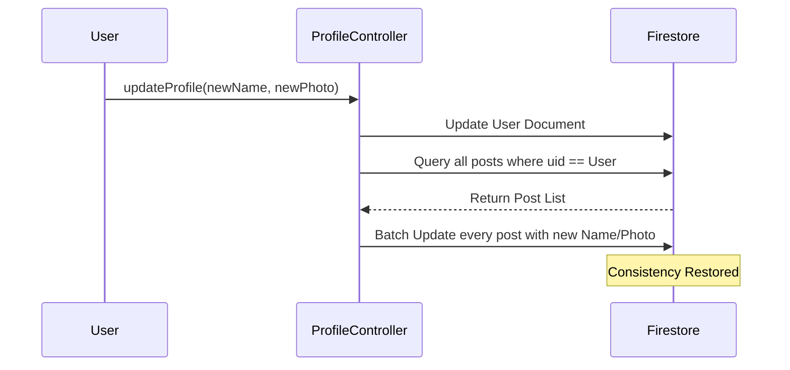

# Architecture Overview: The Quadrant

This document outlines the technical design and data philosophy behind **The Quadrant** networking application.

## 1. Data Philosophy (NoSQL)
We use a **Read-Optimized** approach. In a social app, users read the feed much more often than they update their profile. We prioritize scrolling speed over storage efficiency.

## 2. Core Models

### Users (`/users/{uid}`)
- **Source of Truth**: Stores identity, professional history (nested objects), and social graph (arrays).
- **Social Graph**: `followers` and `following` are stored as arrays of UIDs for O(1) lookups during profile viewing.

### Posts (`/posts/{postId}`)
- **Denormalization**: We store the author's `name`, `username`, and `profileImageUrl` directly inside every post document.
- **Benefit**: The Home Feed can render thousands of posts with zero additional user-profile lookups.
- **Trade-off**: Requires a synchronization engine when profile data changes.

## 3. The Sync Engine
Located in `ProfileController`, this logic ensures consistency across the app.

## 4. Media Management
- **Cloudinary**: Offloads all image hosting and dynamic resizing.
- **Optimization**: We use Cloudinary's `f_auto,q_auto` to ensure fast delivery on mobile devices while saving user data.

## 5. Deployment Architecture
The app is split into two GitHub locations:
1. **Source Repo**: `Quadrant-Networking-App` (Source code in `main`, build in `gh-pages`).
2. **Production Site**: `qomsycode.github.io` (Compiled artifacts for the root domain).

---
*Last Updated: February 2026*
